# Pandora-Stray-Light-Correction


Pandora is a ground-based UV–Visible hyperspectral spectrometer for high-accuracy measurements of atmospheric trace gases, including ozone (O₃), nitrogen dioxide (NO₂) and other gases. As part of the Pandonia Global Network (PGN), Pandora instruments provide reference observations for satellite validation, air quality monitoring, and atmospheric research.

Like all spectrometers, Pandora measurements are affected by optical stray light, where photons are scattered from their true wavelengths onto neighboring detector pixels due to optical imperfections. This redistribution distorts the measured spectrum and weakens atmospheric absorption features, introducing systematic biases into retrievals of ozone and other trace gases.

This repository implements an automated matrix-based stray-light correction algorithm based on the original Pandora calibration methodology. Monochromatic laser calibration measurements are used to estimate the instrument's Stray-Light Distribution Function (SDF), construct a detector-wide stray-light matrix, and compute a correction matrix that is applied to operational Pandora Level-0 (L0) spectra. The implementation replaces manual laser extraction with a fully automated pipeline while preserving compatibility with the original Pandora correction approach.

For more information about the Pandora instrument and the Pandonia Global Network, visit:

Pandonia Global Network: https://www.pandonia-global-network.org/

About Pandora: https://www.pandonia-global-network.org/home/about/

# Analysis

Before developing the stray-light correction algorithm, an analysis was performed to investigate the relationship between the instrument's optical response and the accuracy of ozone (O₃) retrievals across multiple Pandora instruments.

Pandora ozone retrievals are performed primarily within the 305–325 nm spectral region. During the calibration of every Pandora instrument, a 325 nm monochromatic laser is measured to characterize the instrument. Since the 325 nm wavelength lies within the ozone retrieval window, its 's Line Spread Function (LSF) provides a direct indication of the instrument's optical performance and stray-light characteristics.

To evaluate the impact of stray light on ozone retrievals, the normalized 325 nm laser LSFs from several Pandora instruments were compared against the corresponding LSF measured from Pandora 2, which is considered the reference instrument because it consistently produces accurate ozone retrievals.

# Observations

The comparison reveals a clear relationship between the shape of the 325 nm LSF and ozone retrieval performance:

Pandora instruments with accurate O₃ retrievals exhibit 325 nm LSFs that closely overlap the reference Pandora 2 LSF. These instruments have narrow laser profiles with low stray-light levels, indicating good optical performance.
Pandora instruments with inaccurate O₃ retrievals exhibit significantly broader 325 nm LSFs. The increased intensity in the wings of the LSF indicates a higher level of optical stray light, causing photons from the laser peak to spread over a larger portion of the detector.

The figures below illustrate representative examples of both cases.

Good Optical Performance

The following instruments produce ozone retrievals that closely agree with the reference Pandora measurements. Their normalized 325 nm LSFs nearly overlap the reference LSF, indicating minimal stray-light contamination.

<p align="center"> 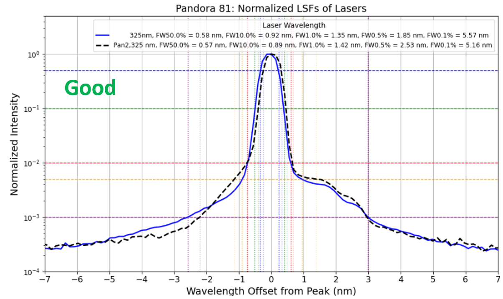 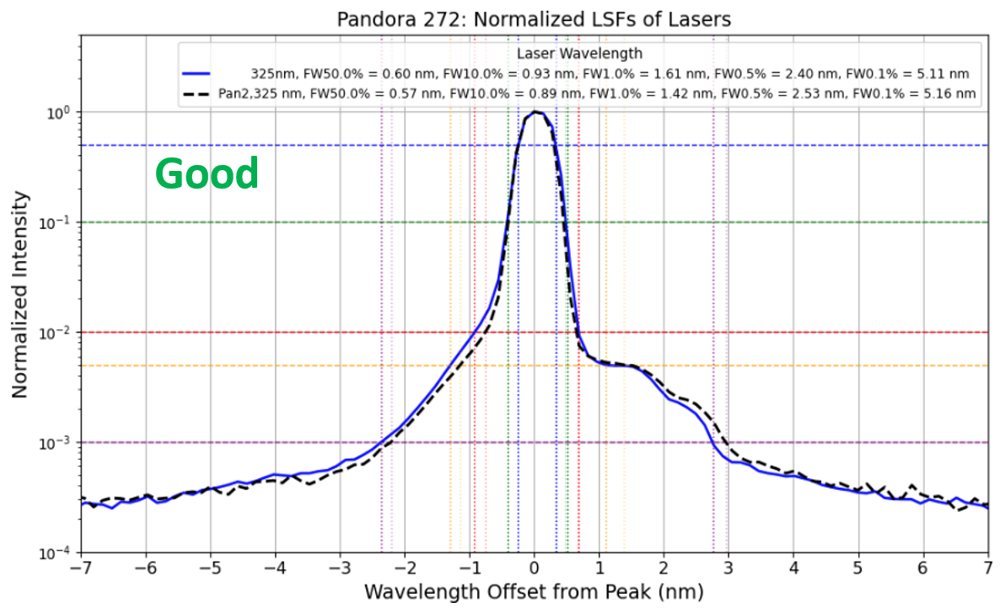 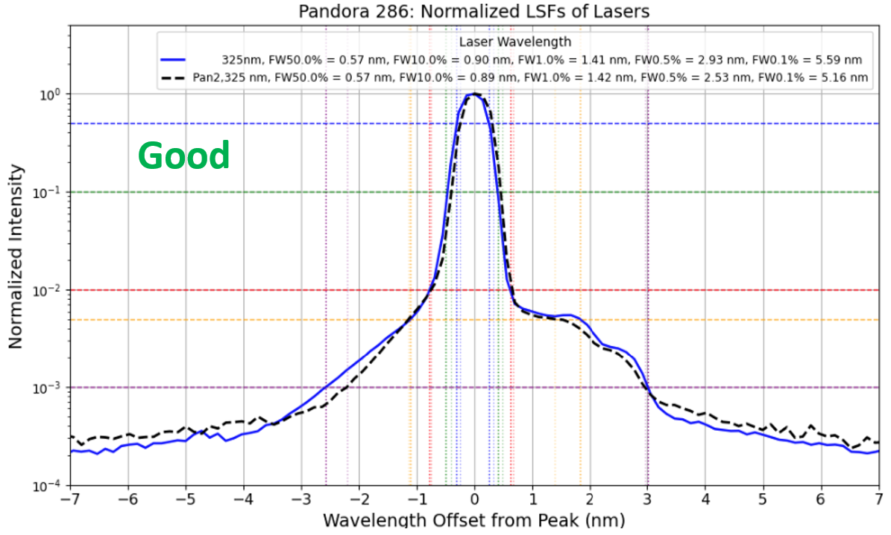 </p>

Moderate to Severe Stray Light affected

The following instruments exhibit progressively broader 325 nm LSFs compared to the reference Pandora. The widening of the LSF, particularly in the tails, indicates increasing levels of stray light that degrade the measured spectra and introduce systematic biases into ozone retrievals.

<p align="center"> 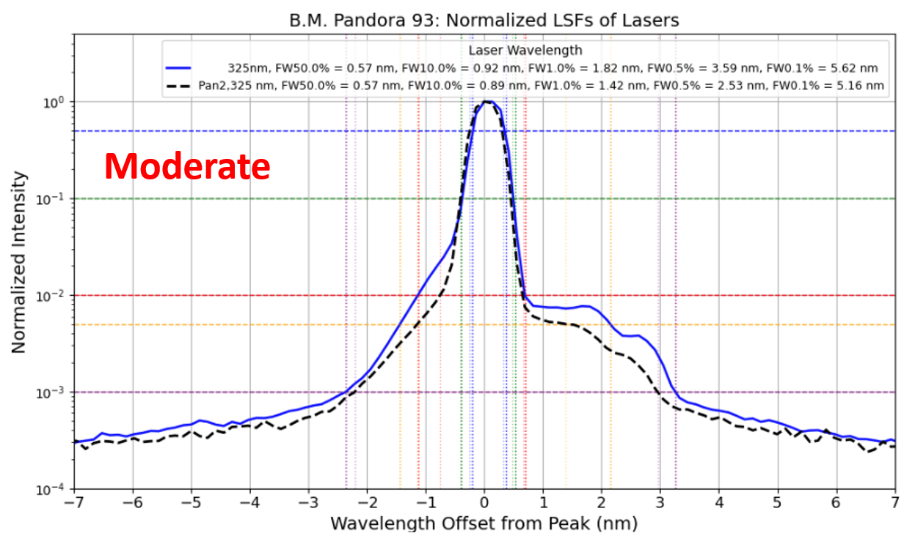 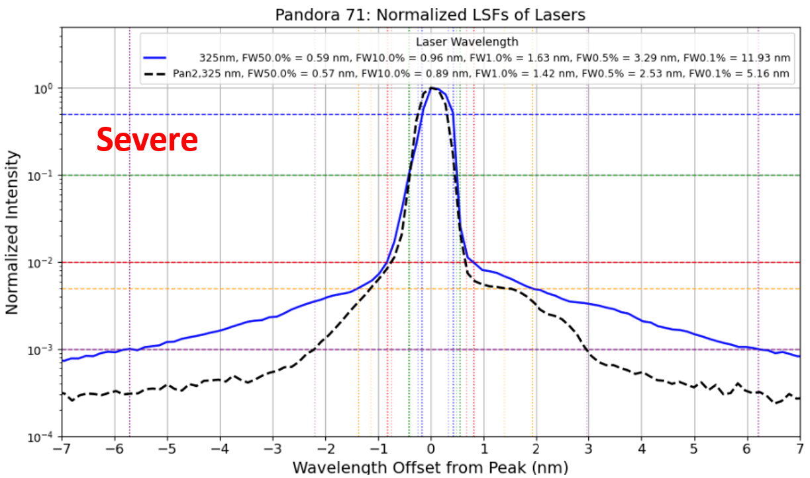 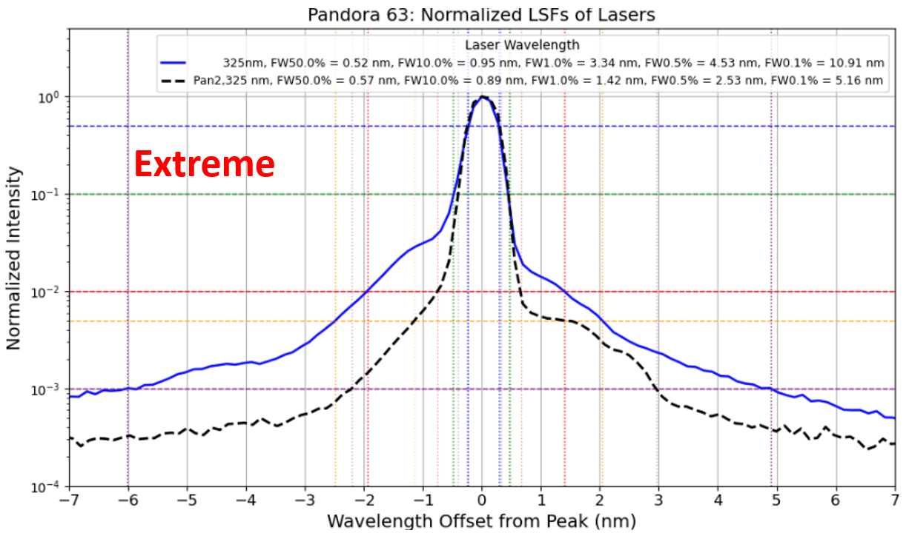 </p>
Conclusion

This analysis demonstrates a strong correlation between the 325 nm laser line spread function and the quality of Pandora ozone retrievals.


## Mathematical Model

Let:

-   $\mathbf{x}$ = true detector signal
-   $\mathbf{y}$ = measured detector signal
-   $\mathbf{S}$ = stray-light matrix

The measured spectrum is

$$
\mathbf{y}=\mathbf{x}+\mathbf{S}\mathbf{x}
$$

or

$$
\mathbf{y}=(\mathbf{I}+\mathbf{S})\mathbf{x}.
$$

Therefore,

$$
\mathbf{x}=(\mathbf{I}+\mathbf{S})^{-1}\mathbf{y},
$$

where

$$
\mathbf{C}=(\mathbf{I}+\mathbf{S})^{-1}
$$

is the correction matrix.

## Stray Light Correction Procedure

### Step 1 -- Laser Calibration

Acquire monochromatic laser measurements spanning the detector
wavelength range.

### Step 2 -- Automatic Laser Extraction

Automatically identify laser exposures, pair bright and dark
measurements, and compute

$$
L=L_{\rm bright}-L_{\rm dark}.
$$

### Step 3 -- Normalize the LSF

$$
L_n(i)=
\frac{L(i)-L_{\min}}
{L_{\max}-L_{\min}}.
$$

<p align="center">
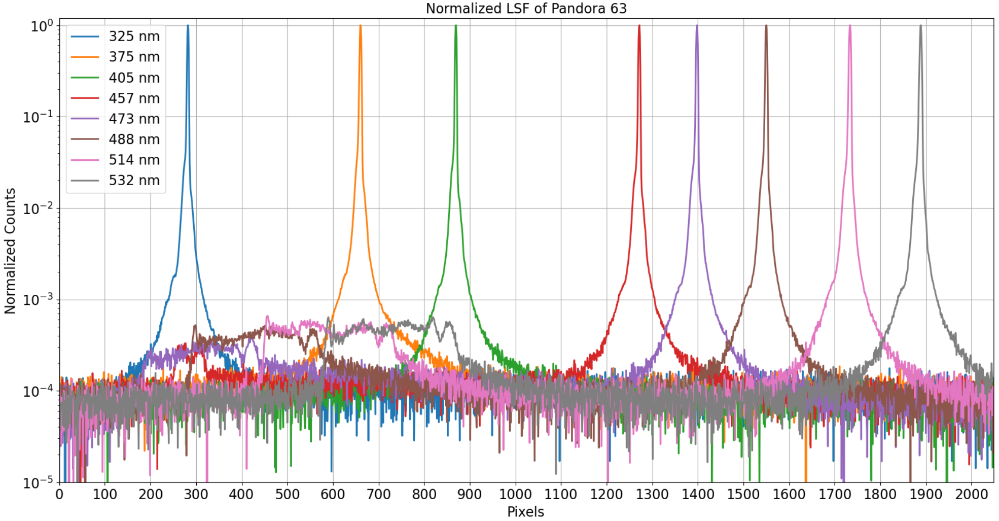
</p>

### Step 4 -- Define the In-band Region

For peak pixel $i_{peak}$ and half-width $k$,

$$
i_{peak}-k\le i\le i_{peak}+k.
$$

### Step 5 -- Compute the Stray-light Distribution

The in-band pixels are excluded and the remaining signal is normalized:

$$
SDF(i)=
\frac{L_n(i)}
{\sum_{IB}L_n},
\qquad i\notin IB.
$$

<p align="center">
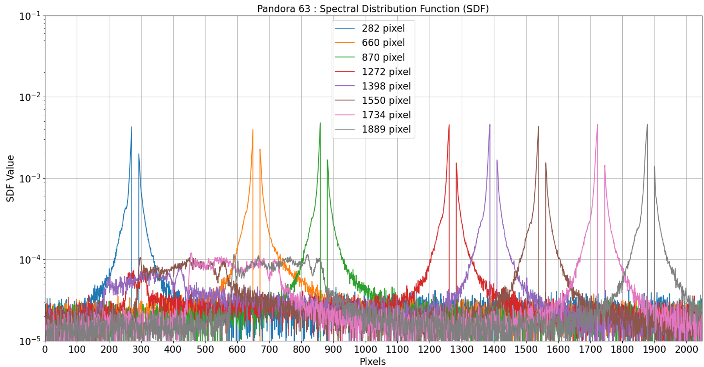
</p>

### Step 6 -- Build the Stray-light Matrix

Each measured SDF is inserted into the detector column corresponding to
its laser peak. Intermediate columns are generated using the same
shifting algorithm as the original Pandora notebook.

### Step 7 -- Compute the Correction Matrix

$$
\mathbf{A}=\mathbf{I}+\mathbf{S}
$$

$$
\mathbf{C}=\mathbf{A}^{-1}
$$

<p align="center">
  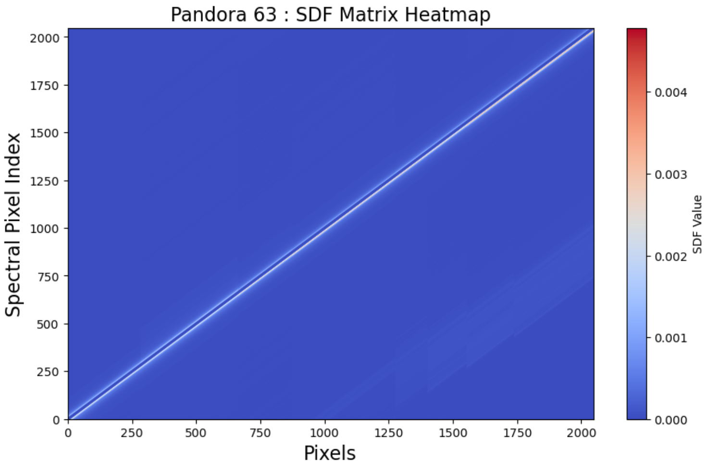
  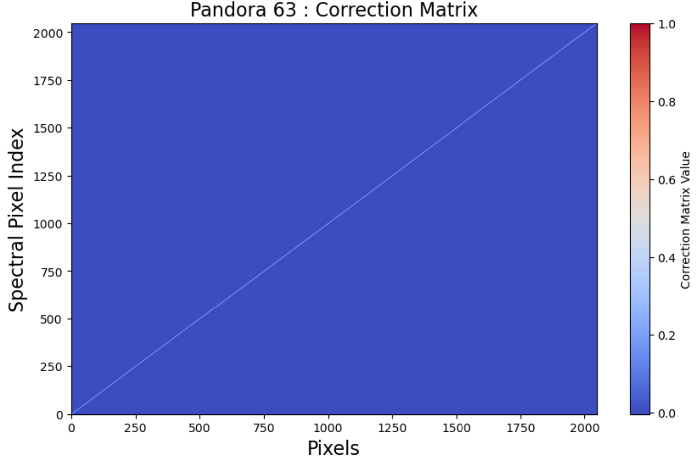
</p>

## L0 File Correction before trace gas retrieval

Dark counts are first removed,

$$
\mathbf{y_d}=\mathbf{y}-\mathbf{d},
$$

the correction matrix is applied,

$$
\mathbf{x_d}=\mathbf{C}\mathbf{y_d},
$$

negative values are clipped to zero,

$$
\mathbf{x_d}=\max(\mathbf{x_d},0),
$$

and the dark counts are restored,

$$
\boxed{\mathbf{x}_{corr}=\mathbf{d}+\max\left(\mathbf{C}(\mathbf{y}-\mathbf{d}),0\right)}
$$

## Validation

The corrected L0 spectra are processed through the standard Pandora
L1/L2 retrieval chain and compared against a reference Pandora 2
instrument. Recommended validation plots include:

<p align="center">
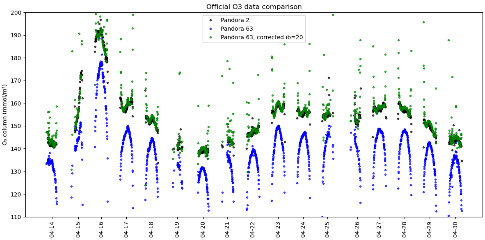
</p>

## Corrected O3 data comparison with Brewer

<p align="center">
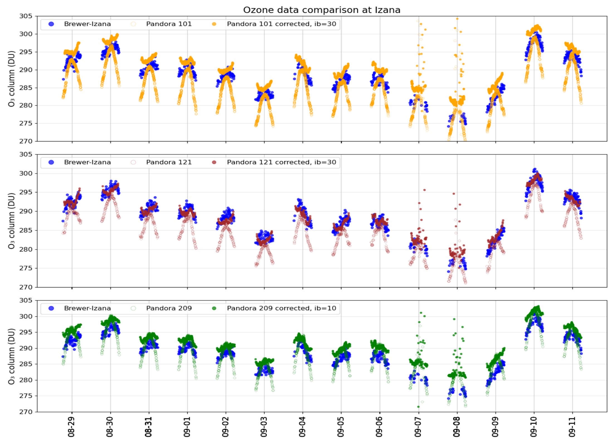
</p>

## Workflow

``` text
Calibration L0
    ↓
Automatic laser detection
    ↓
Bright/Dark pairing
    ↓
Laser LSF extraction
    ↓
Normalized SDF
    ↓
Stray-light Matrix (S)
    ↓
Correction Matrix C=(I+S)^−1
    ↓
Operational L0
    ↓
Corrected L0
    ↓
L1/L2 Retrieval
    ↓
Validation
```
